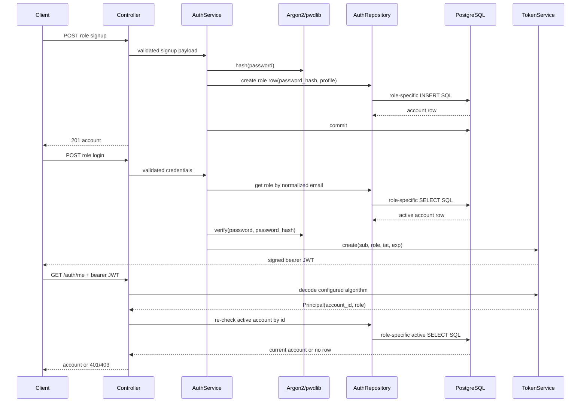

# Authentication flow

Authentication is role-explicit because agents and administrators live in
separate tables. Both signup routes are public. Signup normalizes the email,
validates an agent pincode as a six-digit string, hashes the password with
Argon2 through `pwdlib`, and commits the row through `AuthService`.

Each role has its own login route. The service reads only that role's active
row, verifies the submitted password against `password_hash`, and issues a
signed JWT containing `sub`, `role`, `iat`, and `exp`. `TokenService` decodes
with the configured algorithm only; malformed, expired, or differently
algorithmed tokens return HTTP 401.

`CurrentPrincipal` validates the bearer token and re-reads the account from
the matching table with `deletedAt IS NULL`. `CurrentAgent` and
`CurrentAdmin` then enforce role-specific access and return HTTP 403 when the
principal has the other role. There is intentionally no token/session table,
refresh token, or server-side revocation flow yet. A future refresh-token
store can support rotation and revocation, while a session/version field can
invalidate access tokens before their expiry.

## IMPLEMENTED sequence

