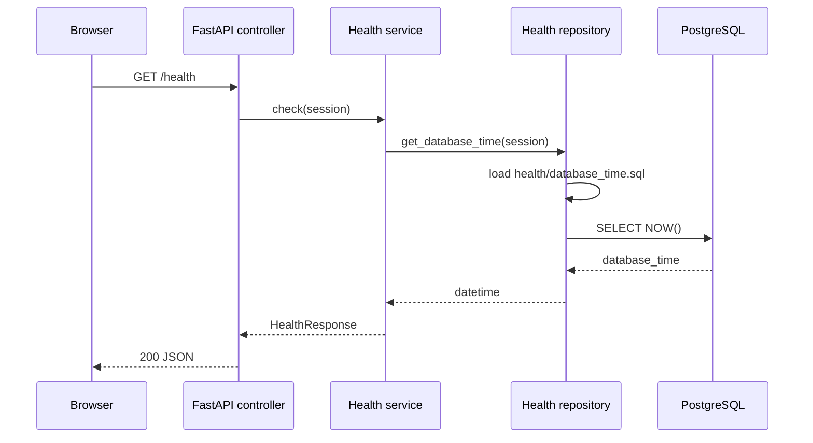

# Health check flow

The health endpoint verifies that the API process is running and that the
backend can reach PostgreSQL. It demonstrates the intended controller →
service → repository → SQL-file boundary.

