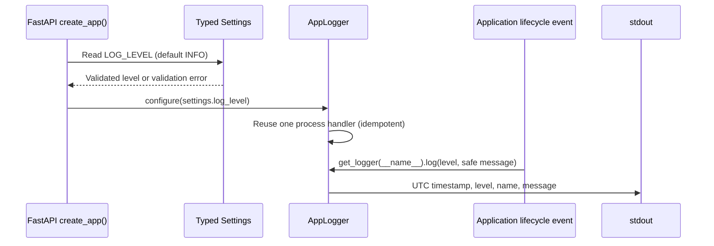

# Application logging sequence (IMPLEMENTED)

`AppLogger` owns one stdout handler and updates its level when the application
is created again. Authentication logs contain only event outcomes and safe
identifiers; secrets and request bodies are intentionally excluded.
