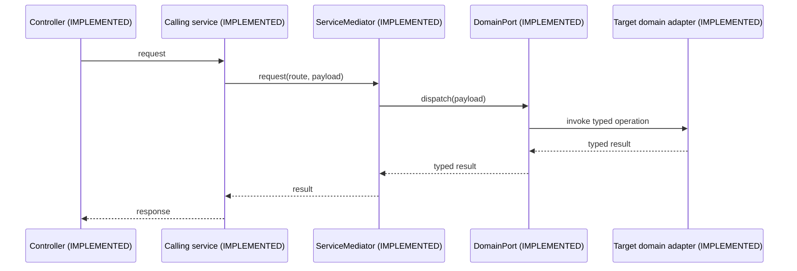

# Cross-domain orchestration

The mediator is an application integration boundary. It dispatches typed
ports in-process today and leaves room for a transport adapter later.

Concrete service-to-service imports are forbidden. A future remote adapter is
`PENDING AI REPLACEMENT` only in the transport sense: the port contract stays
implemented while the in-process adapter may be replaced by HTTP, RPC, or
messaging.
