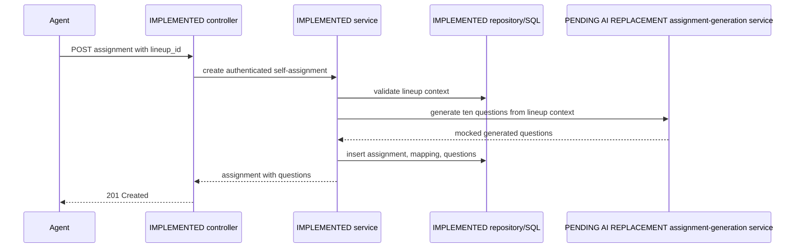

# Create assignment

```mermaid
sequenceDiagram
    participant Agent
    participant Controller as IMPLEMENTED controller
    participant Service as IMPLEMENTED service
    participant DB as IMPLEMENTED repository/SQL
    participant AI as PENDING AI REPLACEMENT assignment-generation service
    Agent->>Controller: POST assignment with lineup_id
    Controller->>Service: create authenticated self-assignment
    Service->>DB: validate lineup context
    Service->>AI: generate ten questions from lineup context
    AI-->>Service: mocked generated questions
    Service->>DB: insert assignment, mapping, questions
    Service-->>Controller: assignment with questions
    Controller-->>Agent: 201 Created
```
