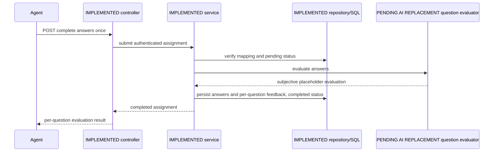

# Submit and evaluate assignment

```mermaid
sequenceDiagram
    participant Agent
    participant Controller as IMPLEMENTED controller
    participant Service as IMPLEMENTED service
    participant DB as IMPLEMENTED repository/SQL
    participant AI as PENDING AI REPLACEMENT question evaluator
    Agent->>Controller: POST complete answers once
    Controller->>Service: submit authenticated assignment
    Service->>DB: verify mapping and pending status
    Service->>AI: evaluate answers
    AI-->>Service: subjective placeholder evaluation
    Service->>DB: persist answers and per-question feedback, completed status
    Service-->>Controller: completed assignment
    Controller-->>Agent: per-question evaluation result
```
