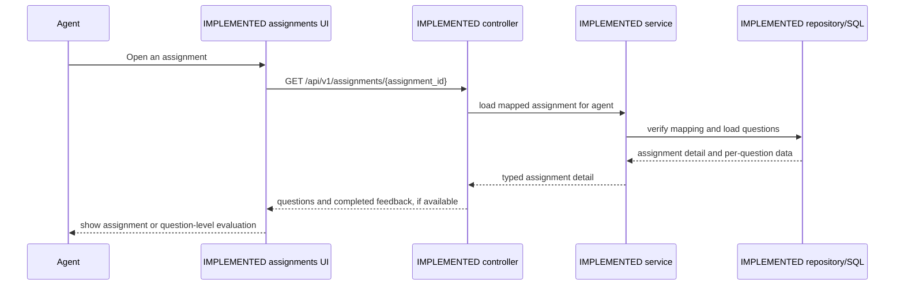

# View a specific assignment

```mermaid
sequenceDiagram
    participant Agent
    participant UI as IMPLEMENTED assignments UI
    participant Controller as IMPLEMENTED controller
    participant Service as IMPLEMENTED service
    participant DB as IMPLEMENTED repository/SQL
    Agent->>UI: Open an assignment
    UI->>Controller: GET /api/v1/assignments/{assignment_id}
    Controller->>Service: load mapped assignment for agent
    Service->>DB: verify mapping and load questions
    DB-->>Service: assignment detail and per-question data
    Service-->>Controller: typed assignment detail
    Controller-->>UI: questions and completed feedback, if available
    UI-->>Agent: show assignment or question-level evaluation
```
