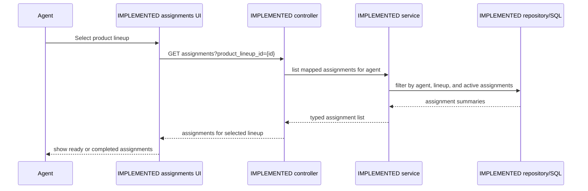

# View assignments for a product lineup

```mermaid
sequenceDiagram
    participant Agent
    participant UI as IMPLEMENTED assignments UI
    participant Controller as IMPLEMENTED controller
    participant Service as IMPLEMENTED service
    participant DB as IMPLEMENTED repository/SQL
    Agent->>UI: Select product lineup
    UI->>Controller: GET assignments?product_lineup_id={id}
    Controller->>Service: list mapped assignments for agent
    Service->>DB: filter by agent, lineup, and active assignments
    DB-->>Service: assignment summaries
    Service-->>Controller: typed assignment list
    Controller-->>UI: assignments for selected lineup
    UI-->>Agent: show ready or completed assignments
```
