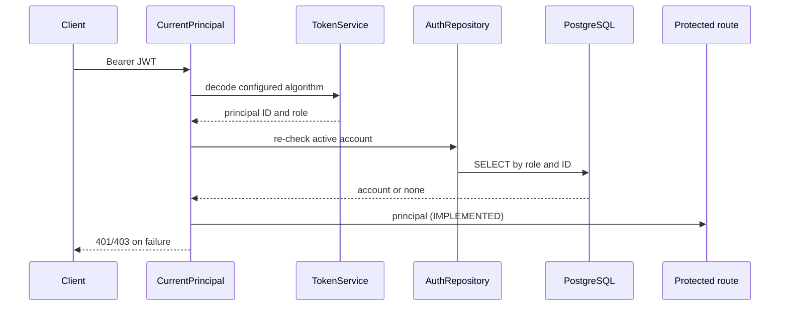

# Authenticate request and authorize role (IMPLEMENTED)

```mermaid
sequenceDiagram
 participant Client
 participant Dependency as CurrentPrincipal
 participant Token as TokenService
 participant Repo as AuthRepository
 participant DB as PostgreSQL
 participant Handler as Protected route
 Client->>Dependency: Bearer JWT
 Dependency->>Token: decode configured algorithm
 Token-->>Dependency: principal ID and role
 Dependency->>Repo: re-check active account
 Repo->>DB: SELECT by role and ID
 DB-->>Dependency: account or none
 Dependency->>Handler: principal (IMPLEMENTED)
 Dependency-->>Client: 401/403 on failure
```

`CurrentAgent` and `CurrentAdmin` enforce role-specific access. The frontend clears an invalid token after a 401.
