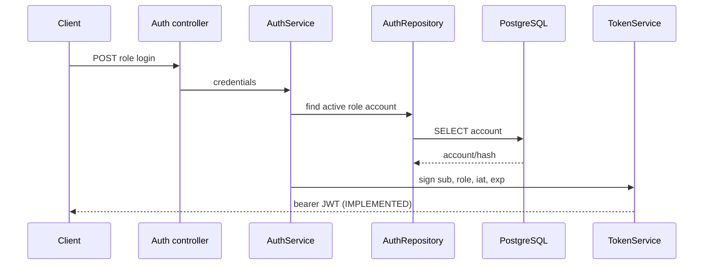

# Authentication login (IMPLEMENTED)

```mermaid
sequenceDiagram
 participant Client
 participant API as Auth controller
 participant Service as AuthService
 participant Repo as AuthRepository
 participant DB as PostgreSQL
 participant Token as TokenService
 Client->>API: POST role login
 API->>Service: credentials
 Service->>Repo: find active role account
 Repo->>DB: SELECT account
 DB-->>Repo: account/hash
 Service->>Token: sign sub, role, iat, exp
 Token-->>Client: bearer JWT (IMPLEMENTED)
```

Invalid credentials return an authentication error. Refresh tokens and server-side revocation are deferred.
