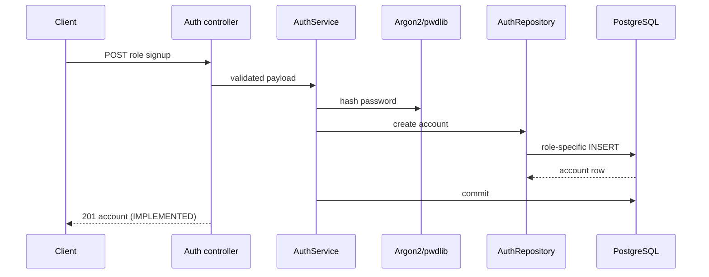

# Authentication signup (IMPLEMENTED)

```mermaid
sequenceDiagram
 participant Client
 participant API as Auth controller
 participant Service as AuthService
 participant Hash as Argon2/pwdlib
 participant Repo as AuthRepository
 participant DB as PostgreSQL
 Client->>API: POST role signup
 API->>Service: validated payload
 Service->>Hash: hash password
 Service->>Repo: create account
 Repo->>DB: role-specific INSERT
 DB-->>Repo: account row
 Service->>DB: commit
 API-->>Client: 201 account (IMPLEMENTED)
```

Agent pincode validation and duplicate-email handling are implemented. Email confirmation is deferred.
