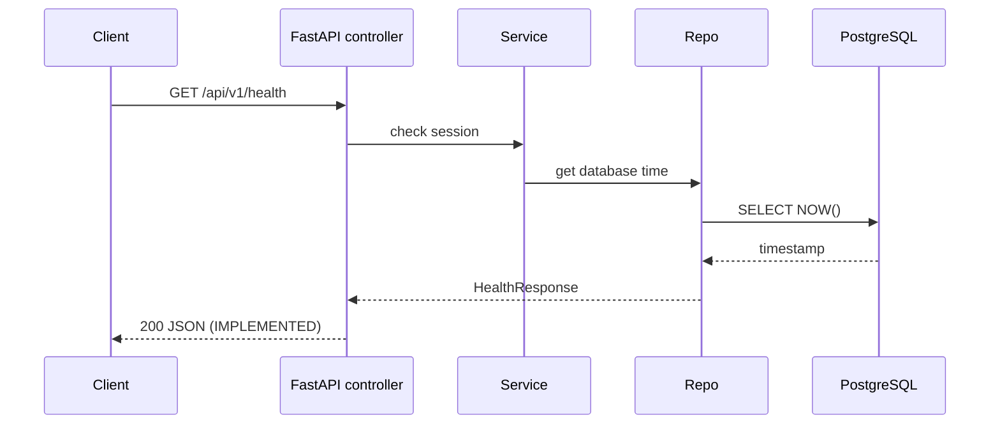

# Health check (IMPLEMENTED)

```mermaid
sequenceDiagram
 participant Client
 participant API as FastAPI controller
 participant Service
 participant Repo
 participant DB as PostgreSQL
 Client->>API: GET /api/v1/health
 API->>Service: check session
 Service->>Repo: get database time
 Repo->>DB: SELECT NOW()
 DB-->>Repo: timestamp
 Repo-->>API: HealthResponse
 API-->>Client: 200 JSON (IMPLEMENTED)
```
