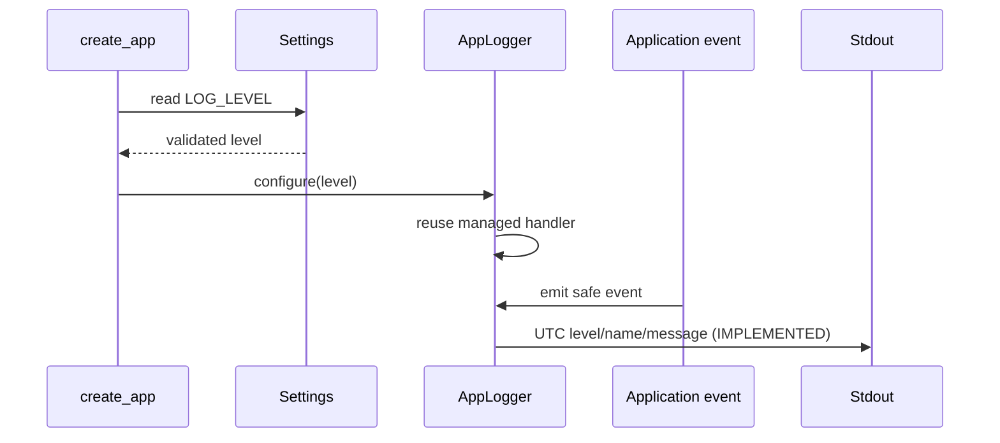

# Configure and emit logging (IMPLEMENTED)

```mermaid
sequenceDiagram
 participant App as create_app
 participant Settings
 participant Logger as AppLogger
 participant Event as Application event
 participant Stdout
 App->>Settings: read LOG_LEVEL
 Settings-->>App: validated level
 App->>Logger: configure(level)
 Logger->>Logger: reuse managed handler
 Event->>Logger: emit safe event
 Logger->>Stdout: UTC level/name/message (IMPLEMENTED)
```
