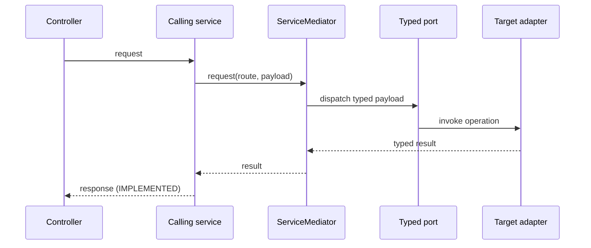

# Mediated cross-domain request (IMPLEMENTED)

Today, `D` is an in-process adapter such as `RepositoryProductContext`.
During a microservice migration, `D` can be replaced by an HTTP, RPC, or
message adapter while the mediator route and consuming service contract remain
unchanged. Network concerns belong in that adapter, including service
authentication, timeouts, retries, version checks, and tracing.
