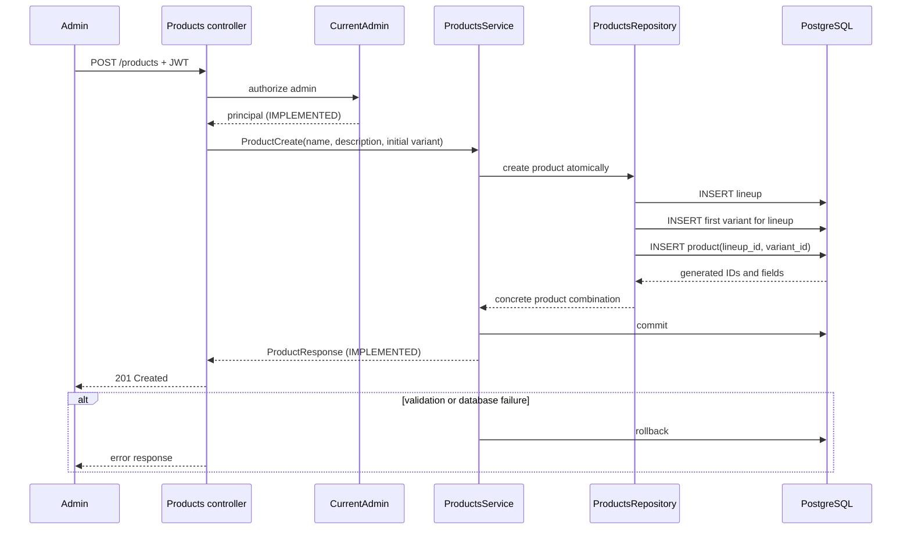

# Create product (IMPLEMENTED)

```mermaid
sequenceDiagram
 participant Admin
 participant API as Products controller
 participant Auth as CurrentAdmin
 participant Service as ProductsService
 participant Repo as ProductsRepository
 participant DB as PostgreSQL
 Admin->>API: POST /products + JWT
 API->>Auth: authorize admin
 Auth-->>API: principal (IMPLEMENTED)
 API->>Service: ProductCreate(name, description, initial variant)
 Service->>Repo: create product atomically
 Repo->>DB: INSERT lineup
 Repo->>DB: INSERT first variant for lineup
 Repo->>DB: INSERT product(lineup_id, variant_id)
 DB-->>Repo: generated IDs and fields
 Repo-->>Service: concrete product combination
 Service->>DB: commit
 Service-->>API: ProductResponse (IMPLEMENTED)
 API-->>Admin: 201 Created
 alt validation or database failure
  Service->>DB: rollback
  API-->>Admin: error response
 end
```

The initial variant is required, so the lineup cannot be created without a
variant. All three inserts share one transaction. Editing and deletion are
deferred.
