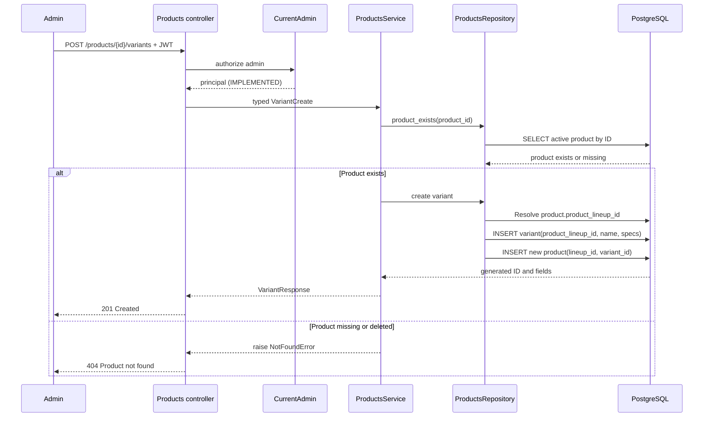

# Create variant (IMPLEMENTED)

The service verifies that the referenced product exists and is not soft-deleted
before inserting the variant. PostgreSQL additionally enforces the
`product_variants.product_lineup_id` foreign key. A variant belongs to a lineup;
the concrete `products` row links that lineup and variant. A new variant creates
a new product-combination row; it never overwrites the existing product.
Variants have no SKU. Editing and deletion are deferred.
