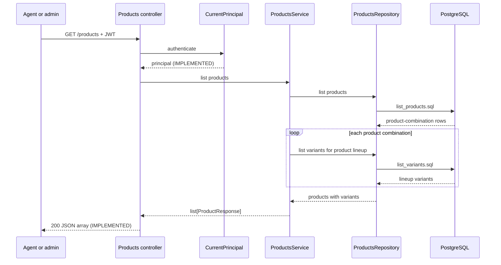

# List catalogue (IMPLEMENTED)

```mermaid
sequenceDiagram
 participant User as Agent or admin
 participant API as Products controller
 participant Auth as CurrentPrincipal
 participant Service as ProductsService
 participant Repo as ProductsRepository
 participant DB as PostgreSQL
 User->>API: GET /products + JWT
 API->>Auth: authenticate
 Auth-->>API: principal (IMPLEMENTED)
 API->>Service: list products
 Service->>Repo: list products
 Repo->>DB: list_products.sql
 DB-->>Repo: product-combination rows
 loop each product combination
  Service->>Repo: list variants for product lineup
  Repo->>DB: list_variants.sql
  DB-->>Repo: lineup variants
 end
 Repo-->>Service: products with variants
 Service-->>API: list[ProductResponse]
 API-->>User: 200 JSON array (IMPLEMENTED)
```

Listing is read-only and performs separate product and lineup-variant queries;
it does not commit a transaction.
