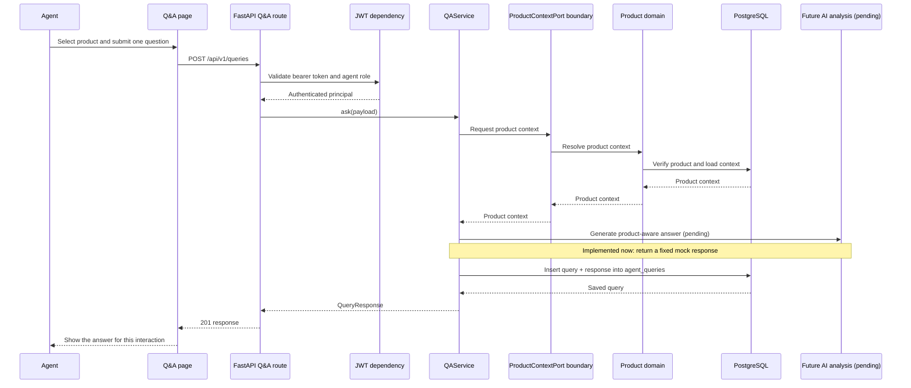

# Ask one product question

```mermaid
sequenceDiagram
    participant Agent
    participant UI as Q&A page
    participant API as FastAPI Q&A route
    participant Auth as JWT dependency
    participant Service as QAService
    participant Mediator as ProductContextPort boundary
    participant Products as Product domain
    participant DB as PostgreSQL
    participant AI as Future AI analysis (pending)

    Agent->>UI: Select product and submit one question
    UI->>API: POST /api/v1/queries
    API->>Auth: Validate bearer token and agent role
    Auth-->>API: Authenticated principal
    API->>Service: ask(payload)
    Service->>Mediator: Request product context
    Mediator->>Products: Resolve product context
    Products->>DB: Verify product and load context
    DB-->>Products: Product context
    Products-->>Mediator: Product context
    Mediator-->>Service: Product context
    Service->>AI: Generate product-aware answer (pending)
    Note over Service,AI: Implemented now: return a fixed mock response
    Service->>DB: Insert query + response into agent_queries
    DB-->>Service: Saved query
    Service-->>API: QueryResponse
    API-->>UI: 201 response
    UI-->>Agent: Show the answer for this interaction
```
